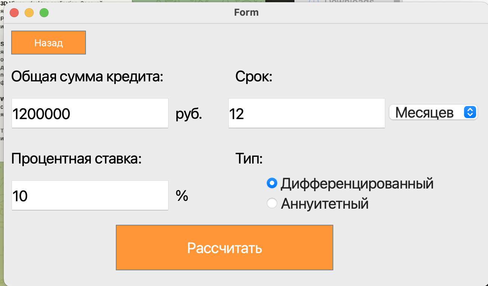
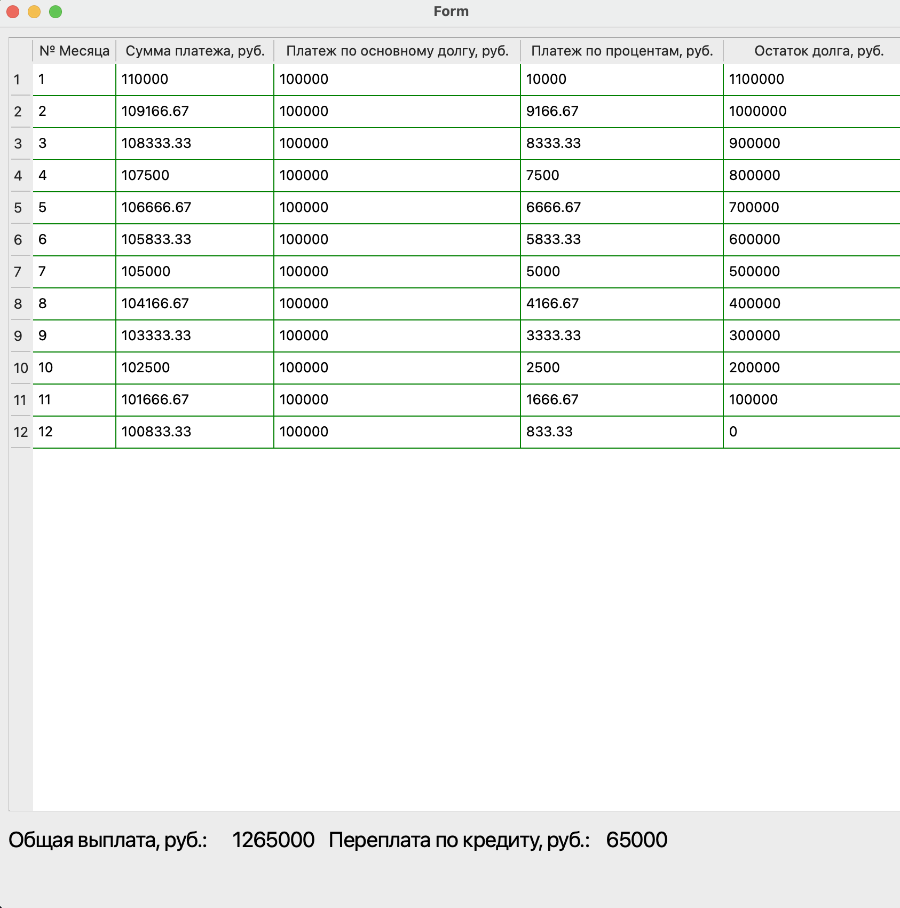

## Desktop Smart Calculator - With interface
---
### Installing application
1. `make install`

### Uninstallg application
1. `make unistall`
2. `make clean`
----
### Presentation application
Данный калькулятор является десктопным приложением.
Имеет функионал:
- Отрисовки графов

- Имеет кредитный калькулятор

- Имеет функций sin, cos, tan, asin, acos, atan, log, sqrt, mod, In

- Имеет стандартные арифмитические функций: +, -, *, /
- Имеет функцию возведения в степень ^

Реализовано через польскую натацию используя два стека.